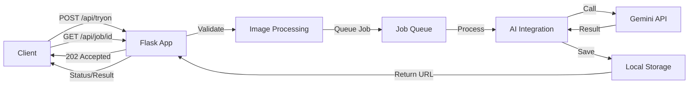

# Context: Because Future Backend - Complete Technical Documentation

**Last Updated:** 2025-11-26  
**Status:** Backend 100% Complete - Ready for Testing  
**Version:** 1.0

This document serves as the **single source of truth** for the Because Future backend codebase. It provides comprehensive technical documentation including architecture, features, file structure, database schema, API endpoints, and implementation details.

---

# Table of Contents

1. [Overview](#overview)
2. [Architecture](#architecture)
3. [Project Structure](#project-structure)
4. [Features & Implementation](#features--implementation)
5. [Database Schema](#database-schema)
6. [API Endpoints](#api-endpoints)
7. [Services & Utilities](#services--utilities)
8. [Models](#models)
9. [Configuration](#configuration)
10. [Authentication & Security](#authentication--security)
11. [Deployment & Operations](#deployment--operations)

---

# Overview

## Primary Goal

Enable users to upload a selfie, paste product URLs, and receive fast, realistic **try-on previews** powered by **Gemini (Nano Banana) API**. The backend supports both mobile app and Chrome extension clients.

## Technology Stack

- **Framework:** Flask (Python 3.9+)
- **Database:** SQLite (with migration system)
- **AI Integration:** Google Gemini (Nano Banana) API
- **Authentication:** JWT (JSON Web Tokens)
- **Storage:** Local file system (`/images` directory)
- **Image Processing:** Pillow (PIL)
- **Web Scraping:** BeautifulSoup4, Requests

## Key Features

✅ **Authentication & User Management** - Custom form-based sign-up/sign-in with JWT  
✅ **Body Measurements** - Comprehensive measurement tracking (20+ fields)  
✅ **Avatar Management** - Background removal via Gemini API  
✅ **Try-On Processing** - Async job queue with Gemini API integration  
✅ **Wardrobe Management** - CRUD operations with categories and sections  
✅ **Garment Scraping** - Brand-specific extractors (Zara, Default)  
✅ **Fitting Analysis** - Size recommendations based on measurements  
✅ **Image Processing** - Validation, resizing, normalization  

---

# Architecture

## System Architecture

```
┌─────────────────┐
│  Mobile App /   │
│ Chrome Extension│
└────────┬────────┘
         │
         │ HTTP/REST API
         │
┌────────▼─────────────────────────────────────┐
│         Flask Backend (app.py)                │
│  ┌─────────────────────────────────────────┐  │
│  │  API Blueprints (api/*.py)              │  │
│  │  - auth, users, body_measurements       │  │
│  │  - tryon, wardrobe, garments, fitting   │  │
│  └─────────────────────────────────────────┘  │
│  ┌─────────────────────────────────────────┐  │
│  │  Services (services/*.py)               │  │
│  │  - ai_integration, job_queue            │  │
│  │  - image_processing, storage            │  │
│  │  - brand_extractors, scraper            │  │
│  └─────────────────────────────────────────┘  │
│  ┌─────────────────────────────────────────┐  │
│  │  Models (models/*.py)                   │  │
│  │  - User, BodyMeasurements, WardrobeItem │  │
│  │  - TryOnJob, WardrobeCategory           │  │
│  └─────────────────────────────────────────┘  │
│  ┌─────────────────────────────────────────┐  │
│  │  Database (SQLite)                      │  │
│  │  - 10 tables with migrations            │  │
│  └─────────────────────────────────────────┘  │
└────────┬─────────────────────────────────────┘
         │
         │ API Calls
         │
┌────────▼────────┐
│ Gemini API      │
│ (Nano Banana)   │
└─────────────────┘
```

## Data Flow



## Request Flow

1. **Client Request** → Flask app (`app.py`)
2. **Authentication** → JWT middleware (`utils/middleware.py`)
3. **Route Handler** → Blueprint (`api/*.py`)
4. **Business Logic** → Service layer (`services/*.py`)
5. **Data Access** → Model layer (`models/*.py`)
6. **Database** → SQLite via `DatabaseManager` (`services/database.py`)
7. **Response** → Standardized format (`utils/response.py`)

---

# Project Structure

## Directory Layout

```
backend/
├── api/                    # API Blueprints (Route Handlers)
│   ├── auth.py            # Authentication endpoints
│   ├── users.py           # User profile endpoints
│   ├── body_measurements.py  # Body measurements CRUD
│   ├── tryon.py           # Try-on job endpoints
│   ├── wardrobe.py        # Wardrobe management
│   ├── garments.py        # Garment scraping/categorization
│   └── fitting.py         # Fitting analysis
│
├── models/                # Data Models (ORM-like)
│   ├── user.py            # User model
│   ├── body_measurements.py  # Body measurements model
│   ├── wardrobe.py        # Wardrobe item model
│   ├── category.py        # Category & section models
│   └── tryon_job.py       # Try-on job model
│
├── services/              # Business Logic Services
│   ├── database.py       # Database abstraction layer
│   ├── auth.py           # JWT token generation/verification
│   ├── ai_integration.py  # Gemini API integration
│   ├── job_queue.py      # Async job processing
│   ├── image_processing.py  # Image validation/resizing
│   ├── storage.py        # Local file storage
│   ├── brand_extractors.py  # Brand-specific scrapers
│   └── scraper.py        # Generic web scraping utilities
│
├── utils/                 # Utility Functions
│   ├── middleware.py     # JWT authentication decorators
│   ├── response.py       # Standardized API responses
│   ├── errors.py         # Custom exception classes
│   ├── validators.py     # Input validation functions
│   └── logger.py         # Structured logging
│
├── migrations/            # Database Migrations
│   ├── 001_initial_schema.sql
│   ├── 002_add_body_measurements.sql
│   ├── 003_add_tryon_jobs.sql
│   ├── 004_enhance_wardrobe.sql
│   ├── 005_add_garment_metadata.sql
│   ├── 006_extend_user_and_measurements.sql
│   ├── 007_add_categories_and_wardrobe_updates.sql
│   ├── 008_add_wardrobe_item_fields.sql
│   ├── 009_add_category_section.sql
│   ├── 010_create_category_sections.sql
│   ├── 011_seed_platform_categories.sql
│   ├── 012_add_user_category_sections.sql
│   ├── 013_add_hip_circumference.sql
│   └── migration_manager.py
│
├── scripts/               # Utility Scripts
│   ├── run_migrations.py  # Run database migrations
│   └── validate.py       # Code validation script
│
├── app.py                 # Flask application entry point
├── config.py              # Configuration management
├── requirements.txt       # Python dependencies
├── env.template           # Environment variables template
├── postman_collection.json  # Postman API collection
└── README.md              # Setup and usage documentation
```

---

# Features & Implementation

## 1. Authentication & User Management

### Files
- **API:** `api/auth.py`, `api/users.py`
- **Models:** `models/user.py`
- **Services:** `services/auth.py`
- **Utils:** `utils/middleware.py`, `utils/validators.py`

### Features
- Custom form-based sign-up with personal info + body measurements
- Custom form-based sign-in (email/password)
- JWT token generation and verification
- User profile CRUD operations
- Password change functionality

### Key Functions

**`api/auth.py`:**
- `create_account()` - Sign up endpoint
- `login()` - Sign in endpoint

**`api/users.py`:**
- `get_profile()` - Get authenticated user's profile
- `update_profile()` - Update user profile
- `change_password()` - Change password

**`models/user.py`:**
- `User` class with methods:
  - `get_by_id()`, `get_by_email()`
  - `save()`, `update_from_dict()`
  - `check_password()`, `to_dict()`

**`services/auth.py`:**
- `generate_token()` - Create JWT token
- `verify_token()` - Verify and decode JWT
- `get_user_from_token()` - Extract user from token

---

## 2. Body Measurements

### Files
- **API:** `api/body_measurements.py`
- **Models:** `models/body_measurements.py`
- **Database:** `migrations/002_add_body_measurements.sql`, `006_extend_user_and_measurements.sql`, `013_add_hip_circumference.sql`

### Features
- Comprehensive measurement tracking (20+ fields)
- CRUD operations
- Metric units (cm) support
- Validation and range checking

### Measurement Fields
- **Basic:** `height`, `weight`
- **Circumferences:** `shoulder_circumference`, `arm_length`, `breast_circumference`, `under_breast_circumference`, `waist_circumference`, `hip_circumference`, `upper_thigh_circumference`, `neck_circumference`, `biceps_circumference`, `upper_hip_circumference`, `wide_hip_circumference`, `calf_circumference`
- **Lengths:** `waist_to_crotch_front_length`, `waist_to_crotch_back_length`, `inner_leg_length`, `foot_length`, `foot_width`
- **Legacy:** `chest`, `waist`, `hips`, `inseam`, `shoulder_width`

### Key Functions

**`api/body_measurements.py`:**
- `create_or_update_measurements()` - POST endpoint
- `get_measurements()` - GET endpoint (authenticated user)
- `get_measurements_by_user()` - GET endpoint (by user_id)
- `update_measurements()` - PUT endpoint

**`models/body_measurements.py`:**
- `BodyMeasurements` class with methods:
  - `get_by_user()`, `save()`, `update_from_dict()`, `to_dict()`

---

## 3. Avatar Management

### Files
- **API:** `app.py` (legacy endpoints)
- **Services:** `services/ai_integration.py` (background removal)
- **Services:** `services/image_processing.py` (image validation)

### Features
- Upload avatar image
- Automatic background removal via Gemini API
- Get/update avatar endpoints
- Image validation and preprocessing

### Key Functions

**`app.py`:**
- `save_avatar()` - POST `/api/save-avatar`
- `get_avatar()` - GET `/api/get-avatar`
- `update_avatar()` - PUT `/api/update-avatar`

**`services/ai_integration.py`:**
- `remove_background()` - Calls Gemini API for background removal

---

## 4. Try-On Processing

### Files
- **API:** `api/tryon.py`
- **Services:** `services/ai_integration.py`, `services/job_queue.py`
- **Models:** `models/tryon_job.py`
- **Database:** `migrations/003_add_tryon_jobs.sql`

### Features
- Async job queue system
- Support for `item_urls[]` array (multiple garments)
- Support for direct image upload
- Multi-garment try-on (top + bottom)
- Job status polling
- Result retrieval

### Key Functions

**`api/tryon.py`:**
- `create_tryon_job()` - POST `/api/tryon`
- `get_job_status()` - GET `/api/job/<job_id>`
- `get_job_result()` - GET `/api/job/<job_id>/result`
- `create_multi_tryon_job()` - POST `/api/tryon/multi`

**`services/job_queue.py`:**
- `JobQueue` class:
  - `create_job()` - Create async job
  - `get_job_status()` - Get job status
  - `_process_job()` - Process job in background thread
  - `_worker_loop()` - Worker thread loop

**`services/ai_integration.py`:**
- `process_tryon()` - Calls Gemini API for try-on processing

**`models/tryon_job.py`:**
- `TryOnJob` class with methods:
  - `get_by_id()`, `get_by_user()`, `save()`, `to_dict()`

---

## 5. Wardrobe Management

### Files
- **API:** `api/wardrobe.py`
- **Models:** `models/wardrobe.py`, `models/category.py`
- **Database:** `migrations/004_enhance_wardrobe.sql`, `007_add_categories_and_wardrobe_updates.sql`, `008_add_wardrobe_item_fields.sql`, `009_add_category_section.sql`, `010_create_category_sections.sql`, `011_seed_platform_categories.sql`, `012_add_user_category_sections.sql`

### Features
- CRUD operations on wardrobe items
- Category management (platform + user-created)
- Category sections (platform + user-created)
- Search and filtering
- Image upload or URL extraction
- New fields: `fabric`, `care_instructions`, `size`, `description`

### Platform Sections
- `upper_body` - Upper body garments
- `lower_body` - Lower body garments
- `accessoires` - Accessories
- `wishlist` - Wishlist items

### Key Functions

**`api/wardrobe.py`:**
- `add_garment()` - POST `/api/wardrobe/items`
- `get_wardrobe_items()` - GET `/api/wardrobe/items`
- `get_wardrobe_item()` - GET `/api/wardrobe/items/<id>`
- `update_wardrobe_item()` - PUT `/api/wardrobe/items/<id>`
- `delete_wardrobe_item()` - DELETE `/api/wardrobe/items/<id>`
- `create_category()` - POST `/api/wardrobe/categories`
- `get_categories()` - GET `/api/wardrobe/categories`
- `get_category_sections()` - GET `/api/wardrobe/category-sections`
- `create_category_section()` - POST `/api/wardrobe/category-sections`
- `extract_garment_from_url()` - POST `/api/wardrobe/extract-from-url`

**`models/wardrobe.py`:**
- `WardrobeItem` class with methods:
  - `get_by_id()`, `get_by_user()`, `save()`, `delete()`, `to_dict()`

**`models/category.py`:**
- `WardrobeCategory` class with methods:
  - `get_by_id()`, `get_by_name()`, `get_all_by_user()`
  - `get_platform_sections()`, `get_user_sections()`, `get_all_sections()`
  - `create_user_section()`, `get_platform_categories()`

---

## 6. Garment Scraping

### Files
- **API:** `api/garments.py`
- **Services:** `services/brand_extractors.py`, `services/scraper.py`
- **Database:** `migrations/005_add_garment_metadata.sql`

### Features
- Brand-specific extractors (Abstract Factory pattern)
- Zara extractor with JSON-LD and script tag parsing
- Default extractor for generic sites
- Image extraction from product pages
- Product metadata caching
- Garment categorization

### Key Functions

**`api/garments.py`:**
- `scrape_product()` - POST `/api/garments/scrape`
- `categorize_garment()` - POST `/api/garments/categorize`
- `extract_images()` - POST `/api/garments/extract-images`

**`services/brand_extractors.py`:**
- `BrandExtractor` (abstract base class)
- `ZaraExtractor` - Zara-specific extraction
- `DefaultExtractor` - Generic extraction
- `BrandExtractorFactory` - Factory pattern for extractor selection

**`services/scraper.py`:**
- `fetch_html()` - Fetch HTML from URL
- `extract_images_from_html()` - Extract image URLs
- `extract_title_from_html()` - Extract product title
- `is_image_url()` - Validate image URL

---

## 7. Fitting Analysis

### Files
- **API:** `api/fitting.py`
- **Models:** `models/body_measurements.py` (for user measurements)

### Features
- Fit checking based on user measurements
- Size recommendations
- Size chart comparison

### Key Functions

**`api/fitting.py`:**
- `check_fit()` - POST `/api/fitting/check`
- `get_size_recommendation()` - GET `/api/fitting/size-recommendation`

---

## 8. Image Processing

### Files
- **Services:** `services/image_processing.py`

### Features
- Image validation (size, format, dimensions)
- Image resizing (max 4096x4096)
- Image normalization (format conversion)
- URL-based image fetching

### Key Functions

**`services/image_processing.py`:**
- `validate_image()` - Validate image data
- `resize_image()` - Resize image to max dimensions
- `normalize_image()` - Convert to target format
- `preprocess_image()` - Full preprocessing pipeline
- `fetch_image_from_url()` - Fetch image from URL

---

# Database Schema

## Tables

### 1. `users`
**Purpose:** User accounts and profiles  
**Migration:** `001_initial_schema.sql`, `006_extend_user_and_measurements.sql`

**Columns:**
- `id` (INTEGER PRIMARY KEY)
- `userid` (VARCHAR(255) UNIQUE) - 8-character unique ID
- `email` (VARCHAR(255) UNIQUE)
- `password` (VARCHAR(255)) - Hashed password
- `first_name`, `last_name` (VARCHAR(255))
- `gender` (VARCHAR(50)) - 'male', 'female', 'other', 'prefer-not-to-say'
- `birthday` (DATE) - YYYY-MM-DD format
- `street`, `city` (TEXT)
- `avatar` (BLOB) - Binary image data
- `is_active` (BOOLEAN)
- `created_at`, `updated_at` (DATETIME)

### 2. `body_measurements`
**Purpose:** User body measurements  
**Migration:** `002_add_body_measurements.sql`, `006_extend_user_and_measurements.sql`, `013_add_hip_circumference.sql`

**Columns:**
- `id` (INTEGER PRIMARY KEY)
- `user_id` (VARCHAR(255) UNIQUE) - Foreign key to users.userid
- `height`, `weight` (REAL) - Basic measurements
- `shoulder_circumference`, `arm_length`, `breast_circumference`, `under_breast_circumference`, `waist_circumference`, `hip_circumference`, `upper_thigh_circumference`, `neck_circumference`, `biceps_circumference`, `upper_hip_circumference`, `wide_hip_circumference`, `calf_circumference` (REAL) - Circumference measurements
- `waist_to_crotch_front_length`, `waist_to_crotch_back_length`, `inner_leg_length`, `foot_length`, `foot_width` (REAL) - Length measurements
- `chest`, `waist`, `hips`, `inseam`, `shoulder_width` (REAL) - Legacy fields
- `unit` (TEXT) - 'metric' or 'imperial' (default: 'metric')
- `created_at`, `updated_at` (DATETIME)

### 3. `tryon_jobs`
**Purpose:** Try-on job queue and status  
**Migration:** `003_add_tryon_jobs.sql`

**Columns:**
- `job_id` (VARCHAR(255) PRIMARY KEY) - UUID
- `user_id` (VARCHAR(255)) - Foreign key to users.userid
- `status` (VARCHAR(50)) - 'queued', 'processing', 'done', 'failed'
- `progress` (INTEGER) - 0-100
- `person_image_path` (TEXT)
- `garment_image_path` (TEXT)
- `result_image_path` (TEXT)
- `error_message` (TEXT)
- `created_at`, `updated_at` (DATETIME)

### 4. `wardrobe`
**Purpose:** User wardrobe items  
**Migration:** `001_initial_schema.sql`, `004_enhance_wardrobe.sql`, `007_add_categories_and_wardrobe_updates.sql`, `008_add_wardrobe_item_fields.sql`

**Columns:**
- `id` (INTEGER PRIMARY KEY)
- `user_id` (VARCHAR(255)) - Foreign key to users.userid
- `garment_id` (VARCHAR(255)) - Legacy field
- `garment_image` (BLOB) - Legacy field
- `garment_type` (VARCHAR(50)) - Legacy field
- `garment_url` (TEXT) - Legacy field
- `category` (VARCHAR(100)) - Legacy category field
- `garment_category_type` (VARCHAR(50)) - Legacy field
- `brand` (VARCHAR(255))
- `color` (VARCHAR(100))
- `is_external` (BOOLEAN)
- `title` (TEXT)
- `price` (REAL)
- `category_id` (INTEGER) - Foreign key to wardrobe_categories.id
- `custom_category_name` (VARCHAR(255))
- `category_section` (VARCHAR(100)) - 'upper_body', 'lower_body', 'accessoires', 'wishlist', or user-created
- `fabric` (TEXT) - JSON array: `[{"name": "cotton", "percentage": 100}]`
- `care_instructions` (TEXT)
- `size` (TEXT)
- `description` (TEXT)
- `image_path` (TEXT) - Path to image file in local storage
- `date_added`, `created_at`, `updated_at` (DATETIME)

### 5. `wardrobe_categories`
**Purpose:** User-created categories  
**Migration:** `007_add_categories_and_wardrobe_updates.sql`, `009_add_category_section.sql`

**Columns:**
- `id` (INTEGER PRIMARY KEY)
- `user_id` (VARCHAR(255)) - Foreign key to users.userid
- `name` (VARCHAR(255)) - Category name
- `description` (TEXT)
- `category_section` (VARCHAR(100)) - Section this category belongs to
- `created_at`, `updated_at` (DATETIME)

### 6. `category_sections`
**Purpose:** Platform and user-created category sections  
**Migration:** `010_create_category_sections.sql`, `012_add_user_category_sections.sql`

**Columns:**
- `id` (INTEGER PRIMARY KEY)
- `name` (VARCHAR(100) UNIQUE) - Section identifier
- `display_name` (VARCHAR(255)) - Human-readable name
- `description` (TEXT)
- `sort_order` (INTEGER)
- `icon_name` (VARCHAR(100)) - Icon identifier (not stored in DB, returned via API)
- `icon_url` (TEXT) - Icon URL (not stored in DB, returned via API)
- `user_id` (VARCHAR(255)) - NULL for platform sections, user_id for user-created sections
- `created_at`, `updated_at` (DATETIME)

**Platform Sections (seeded):**
- `upper_body` - Upper Body
- `lower_body` - Lower Body
- `accessoires` - Accessories
- `wishlist` - Wishlist

### 7. `platform_categories`
**Purpose:** Platform-defined categories  
**Migration:** `011_seed_platform_categories.sql`

**Columns:**
- `id` (INTEGER PRIMARY KEY)
- `section_name` (VARCHAR(100)) - Foreign key to category_sections.name
- `name` (VARCHAR(255)) - Category identifier
- `display_name` (VARCHAR(255)) - Human-readable name
- `description` (TEXT)
- `sort_order` (INTEGER)
- `created_at` (DATETIME)

**Platform Categories (seeded):**
- **Upper Body:** T-shirts, Shirts, Sweaters, Jackets, Dresses
- **Lower Body:** Pants, Jeans, Shorts, Skirts, Leggings
- **Accessories:** Bags, Shoes, Hats, Jewelry, Belts

### 8. `garment_metadata`
**Purpose:** Cached scraped product metadata  
**Migration:** `005_add_garment_metadata.sql`

**Columns:**
- `id` (INTEGER PRIMARY KEY)
- `url` (TEXT UNIQUE) - Product URL
- `title` (TEXT)
- `images` (TEXT) - JSON array of image URLs
- `price` (REAL)
- `sizes` (TEXT) - JSON array of available sizes
- `colors` (TEXT) - JSON array of available colors
- `brand` (VARCHAR(255))
- `metadata` (TEXT) - JSON object with additional data
- `created_at`, `updated_at` (DATETIME)

### 9. `schema_migrations`
**Purpose:** Track applied migrations  
**Migration:** `001_initial_schema.sql`

**Columns:**
- `version` (INTEGER PRIMARY KEY)
- `name` (VARCHAR(255))
- `applied_at` (DATETIME)

### 10. `hello`
**Purpose:** Test table (legacy)  
**Migration:** `001_initial_schema.sql`

---

# API Endpoints

## Authentication

### `POST /api/create-account`
**File:** `api/auth.py`  
**Auth:** Not required  
**Description:** Create new user account with personal info and body measurements

**Request Body:**
```json
{
  "email": "user@example.com",
  "password": "password123",
  "confirm_password": "password123",
  "first_name": "John",
  "last_name": "Doe",
  "gender": "male",
  "birthday": "1990-01-15",
  "street": "123 Main St",
  "city": "New York",
  "height": 175,
  "weight": 70,
  ...
}
```

**Response:** `201 Created`
```json
{
  "success": true,
  "data": {
    "token": "jwt_token_here",
    "user": {...}
  }
}
```

### `POST /api/login`
**File:** `api/auth.py`  
**Auth:** Not required  
**Description:** Sign in with email and password

**Request Body:**
```json
{
  "email": "user@example.com",
  "password": "password123"
}
```

**Response:** `200 OK`
```json
{
  "success": true,
  "data": {
    "token": "jwt_token_here",
    "user": {...}
  }
}
```

## User Profile

### `GET /api/users/profile`
**File:** `api/users.py`  
**Auth:** Required  
**Description:** Get authenticated user's profile

### `PUT /api/users/profile`
**File:** `api/users.py`  
**Auth:** Required  
**Description:** Update authenticated user's profile

### `POST /api/users/profile/change-password`
**File:** `api/users.py`  
**Auth:** Required  
**Description:** Change user password


## Body Measurements

### `POST /api/body-measurements`
**File:** `api/body_measurements.py`  
**Auth:** Required  
**Description:** Create or update body measurements for authenticated user

### `GET /api/body-measurements`
**File:** `api/body_measurements.py`  
**Auth:** Required  
**Description:** Get authenticated user's body measurements


### `PUT /api/body-measurements`
**File:** `api/body_measurements.py`  
**Auth:** Required  
**Description:** Update authenticated user's body measurements

## Avatar

### `POST /api/save-avatar`
**File:** `app.py`  
**Auth:** Required  
**Description:** Save avatar image with background removal

**Request:** `multipart/form-data`
- `avatar` (file)
- `user_id` (text)

### `GET /api/get-avatar`
**File:** `app.py`  
**Auth:** Required  
**Description:** Get authenticated user's avatar image

### `PUT /api/update-avatar`
**File:** `app.py`  
**Auth:** Required  
**Description:** Update avatar with base64 encoded image

## Try-On

### `POST /api/tryon`
**File:** `api/tryon.py`  
**Auth:** Required  
**Description:** Create try-on job (async)

**Request:** `multipart/form-data`
- `selfie` (file) OR `avatar_id` (text)
- `item_urls` (text) - JSON array: `["https://..."]`
- `garment_image` (file) - Alternative to item_urls
- `garment_url` (text) - Single URL (backward compatibility)
- `options` (text) - JSON object with garment_index, etc.

**Response:** `202 Accepted`
```json
{
  "success": true,
  "data": {
    "job_id": "uuid",
    "status": "queued"
  }
}
```

### `GET /api/job/<job_id>`
**File:** `api/tryon.py`  
**Auth:** Required  
**Description:** Get job status

**Response:** `200 OK`
```json
{
  "success": true,
  "data": {
    "status": "done",
    "progress": 100,
    "result_url": "/images/tryon-results/..."
  }
}
```

### `GET /api/job/<job_id>/result`
**File:** `api/tryon.py`  
**Auth:** Required  
**Description:** Get result image (returns image file or URL)

### `POST /api/tryon/multi`
**File:** `api/tryon.py`  
**Auth:** Required  
**Description:** Multi-garment try-on (top + bottom)

## Wardrobe Management

### `POST /api/wardrobe/items`
**File:** `api/wardrobe.py`  
**Auth:** Required  
**Description:** Add garment to wardrobe

**Request:** `multipart/form-data` OR `application/json`
- `garment_image` (file) OR `garment_url` (text)
- `category_section` (text) - Required
- `category_id` (text) - Optional
- `title`, `brand`, `color`, `size`, `description` (text)
- `fabric` (text) - JSON array: `[{"name": "cotton", "percentage": 100}]`
- `care_instructions` (text)

### `GET /api/wardrobe/items`
**File:** `api/wardrobe.py`  
**Auth:** Required  
**Description:** Get wardrobe items with search and filtering

**Query Params:**
- `category` (string) - Filter by category
- `category_id` (integer) - Filter by category ID
- `search` (string) - Search in title/brand/description

### `GET /api/wardrobe/items/<id>`
**File:** `api/wardrobe.py`  
**Auth:** Required  
**Description:** Get specific wardrobe item

### `PUT /api/wardrobe/items/<id>`
**File:** `api/wardrobe.py`  
**Auth:** Required  
**Description:** Update wardrobe item

### `DELETE /api/wardrobe/items/<id>`
**File:** `api/wardrobe.py`  
**Auth:** Required  
**Description:** Delete wardrobe item

### `POST /api/wardrobe/categories`
**File:** `api/wardrobe.py`  
**Auth:** Required  
**Description:** Create user category

**Request Body:**
```json
{
  "name": "casual_shirts",
  "description": "Casual shirts for everyday wear",
  "category_section": "upper_body"
}
```

### `GET /api/wardrobe/categories`
**File:** `api/wardrobe.py`  
**Auth:** Required  
**Description:** Get all categories (platform + user-created, grouped by section)

**Query Params:**
- `search` (string) - Search categories
- `category_section` (string) - Filter by section

### `GET /api/wardrobe/category-sections`
**File:** `api/wardrobe.py`  
**Auth:** Required  
**Description:** Get all category sections (platform + user-created)

### `POST /api/wardrobe/category-sections`
**File:** `api/wardrobe.py`  
**Auth:** Required  
**Description:** Create user-specific category section

**Request Body:**
```json
{
  "name": "summer_collection",
  "display_name": "Summer Collection",
  "description": "My summer wardrobe items",
  "icon_name": "summer_icon",
  "icon_url": "https://example.com/icons/summer.png",
  "sort_order": 5
}
```

### `GET /api/wardrobe/categories/<id>`
**File:** `api/wardrobe.py`  
**Auth:** Required  
**Description:** Get category by ID

### `PUT /api/wardrobe/categories/<id>`
**File:** `api/wardrobe.py`  
**Auth:** Required  
**Description:** Update category

### `DELETE /api/wardrobe/categories/<id>`
**File:** `api/wardrobe.py`  
**Auth:** Required  
**Description:** Delete category

### `POST /api/wardrobe/extract-from-url`
**File:** `api/wardrobe.py`  
**Auth:** Required  
**Description:** Extract garment information from URL without adding to wardrobe

## Garments

### `POST /api/garments/scrape`
**File:** `api/garments.py`  
**Auth:** Not required  
**Description:** Scrape product page

### `POST /api/garments/categorize`
**File:** `api/garments.py`  
**Auth:** Not required  
**Description:** Categorize garment from image

### `POST /api/garments/extract-images`
**File:** `api/garments.py`  
**Auth:** Optional  
**Description:** Extract only images from product URL. Uses the same brand-specific extractors as `/scrape` but returns only images. Returns a `reason` field if no images are found explaining possible causes (JavaScript-rendered pages, dynamic loading, etc.). **Note:** For comprehensive product data (title, price, sizes, colors, category), use `/api/garments/scrape` instead.

## Fitting

### `POST /api/fitting/check`
**File:** `api/fitting.py`  
**Auth:** Required  
**Description:** Check if garment fits based on user measurements

### `GET /api/fitting/size-recommendation`
**File:** `api/fitting.py`  
**Auth:** Required  
**Description:** Get size recommendation based on size chart

## Utilities

### `GET /health`
**File:** `app.py`  
**Auth:** Not required  
**Description:** Health check endpoint

### `POST /api/remove-bg`
**File:** `app.py`  
**Auth:** Not required  
**Description:** Remove background from image (uses Gemini API)

### `GET /images/<path:filename>`
**File:** `app.py`  
**Auth:** Not required  
**Description:** Serve images from local storage

---

# Services & Utilities

## Database Service

**File:** `services/database.py`

**Class:** `DatabaseManager`

**Purpose:** Database abstraction layer for SQLite operations

**Key Methods:**
- `execute_query()` - Execute SQL query
- `execute_many()` - Execute multiple queries
- `execute_script()` - Execute SQL script
- `get_lastrowid()` - Get last inserted row ID
- `table_exists()` - Check if table exists
- `get_tables()` - Get all table names

**Usage:**
```python
from services.database import db_manager

result = db_manager.execute_query(
    "SELECT * FROM users WHERE email = ?",
    (email,),
    fetch_one=True
)
```

## Authentication Service

**File:** `services/auth.py`

**Functions:**
- `generate_token(user_id, email, additional_claims=None)` - Generate JWT token
- `verify_token(token)` - Verify and decode JWT token
- `get_user_from_token(token)` - Extract user_id from token

## AI Integration Service

**File:** `services/ai_integration.py`

**Functions:**
- `process_tryon(person_image, garment_image, garment_type, garment_details)` - Process try-on with Gemini API
- `remove_background(image_data)` - Remove background using Gemini API

**Gemini API Integration:**
- Uses `google.generativeai` library
- Model: `gemini-1.5-pro` or `gemini-1.5-flash` (configurable)
- API key from environment variable `GEMINI_API_KEY`

## Job Queue Service

**File:** `services/job_queue.py`

**Class:** `JobQueue`

**Purpose:** Async job processing for try-on operations

**Features:**
- In-memory queue (`queue.Queue`)
- Background worker thread
- Job status tracking
- Timeout handling (120 seconds default)
- Max queue size (50 jobs default)

**Key Methods:**
- `create_job()` - Create new try-on job
- `get_job_status()` - Get job status
- `stop()` - Stop worker thread

## Image Processing Service

**File:** `services/image_processing.py`

**Functions:**
- `validate_image(image_data, filename)` - Validate image (size, format, dimensions)
- `resize_image(image_data, max_dimension)` - Resize image to max dimensions
- `normalize_image(image_data, target_format)` - Convert image format
- `preprocess_image(image_data, filename, max_dimension)` - Full preprocessing pipeline
- `fetch_image_from_url(url, timeout)` - Fetch image from URL

**Constraints:**
- Max file size: 6MB
- Max dimensions: 4096x4096
- Supported formats: PNG, JPEG, WebP

## Storage Service

**File:** `services/storage.py`

**Class:** `StorageService`

**Purpose:** Local file storage management

**Storage Structure:**
```
images/
├── tryon-results/    # Try-on result images
├── avatars/          # User avatar images
└── wardrobe/         # Wardrobe item images
```

**Key Methods:**
- `upload_image(image_data, file_path, subdirectory)` - Upload image to local storage
- `delete_image(file_path)` - Delete image from storage
- `get_image_path(file_path)` - Get full path to image

## Brand Extractors Service

**File:** `services/brand_extractors.py`

**Classes:**
- `BrandExtractor` (abstract base class)
- `ZaraExtractor` - Zara-specific product extraction
- `DefaultExtractor` - Generic product extraction
- `BrandExtractorFactory` - Factory for extractor selection

**Zara Extractor Features:**
- JSON-LD structured data extraction
- Script tag data extraction
- Multiple image extraction strategies
- Size and color extraction

## Scraper Service

**File:** `services/scraper.py`

**Functions:**
- `fetch_html(url, timeout)` - Fetch HTML from URL
- `extract_images_from_html(html_content, base_url)` - Extract image URLs
- `extract_title_from_html(html_content)` - Extract product title
- `is_image_url(url)` - Validate image URL

## Middleware

**File:** `utils/middleware.py`

**Decorators:**
- `@require_auth` - Require JWT authentication
- `@optional_auth` - Optional JWT authentication

**Usage:**
```python
from utils.middleware import require_auth

@require_auth
def my_endpoint():
    user_id = request.user_id  # Available after authentication
    ...
```

## Response Utilities

**File:** `utils/response.py`

**Functions:**
- `success_response(data, message, status_code)` - Standardized success response
- `error_response(error, status_code)` - Standardized error response
- `error_response_from_string(message, status_code, error_code)` - Error response from string

## Error Handling

**File:** `utils/errors.py`

**Custom Exceptions:**
- `ValidationError` - Input validation errors
- `AuthenticationError` - Authentication failures
- `DatabaseError` - Database operation errors
- `NotFoundError` - Resource not found errors

## Validators

**File:** `utils/validators.py`

**Functions:**
- `validate_email(email)` - Validate email format
- `validate_password(password, min_length)` - Validate password strength
- `validate_numeric(value, field_name, min_value, max_value)` - Validate numeric values
- `validate_url(url)` - Validate URL format
- `validate_required(data, fields)` - Validate required fields

## Logging

**File:** `utils/logger.py`

**Features:**
- Structured JSON logging
- Daily log file rotation
- Separate error logs
- Function entry/exit tracking
- Exception logging

**Log Files:**
- `logs/app.log` - Application logs
- `logs/errors.log` - Error logs

---

# Models

## User Model

**File:** `models/user.py`

**Class:** `User`

**Methods:**
- `get_by_id(userid)` - Get user by ID
- `get_by_email(email)` - Get user by email
- `save()` - Save user (create or update)
- `update_from_dict(data)` - Update from dictionary
- `check_password(password)` - Verify password
- `to_dict(include_avatar, include_password)` - Convert to dictionary

## Body Measurements Model

**File:** `models/body_measurements.py`

**Class:** `BodyMeasurements`

**Methods:**
- `get_by_user(user_id)` - Get measurements for user
- `save()` - Save measurements (create or update)
- `update_from_dict(data)` - Update from dictionary
- `to_dict()` - Convert to dictionary

## Wardrobe Item Model

**File:** `models/wardrobe.py`

**Class:** `WardrobeItem`

**Methods:**
- `get_by_id(item_id, user_id)` - Get item by ID
- `get_by_user(user_id, category, category_id, search)` - Get items for user
- `save()` - Save item (create or update)
- `delete()` - Delete item
- `to_dict()` - Convert to dictionary

## Category Model

**File:** `models/category.py`

**Class:** `WardrobeCategory`

**Methods:**
- `get_by_id(category_id, user_id)` - Get category by ID
- `get_by_name(name, user_id)` - Get category by name
- `get_all_by_user(user_id, search, category_section)` - Get all user categories
- `get_platform_sections()` - Get platform-defined sections
- `get_user_sections(user_id)` - Get user-created sections
- `get_all_sections(user_id)` - Get all sections (platform + user)
- `create_user_section(user_id, name, display_name, ...)` - Create user section
- `get_platform_categories(category_section)` - Get platform categories
- `save()` - Save category
- `delete()` - Delete category
- `to_dict()` - Convert to dictionary

## Try-On Job Model

**File:** `models/tryon_job.py`

**Class:** `TryOnJob`

**Methods:**
- `get_by_id(job_id, user_id)` - Get job by ID
- `get_by_user(user_id, status, limit)` - Get jobs for user
- `save()` - Save job
- `to_dict()` - Convert to dictionary

---

# Configuration

## Configuration File

**File:** `config.py`

**Class:** `Config`

**Configuration Variables:**
- `FLASK_ENV` - Flask environment (development/production)
- `FLASK_DEBUG` - Debug mode
- `SECRET_KEY` - Flask secret key
- `DATABASE_PATH` - SQLite database path
- `GEMINI_API_KEY` - Gemini API key
- `GEMINI_MODEL_NAME` - Gemini model name (default: 'gemini-1.5-pro')
- `JWT_SECRET_KEY` - JWT secret key
- `JWT_ALGORITHM` - JWT algorithm (default: 'HS256')
- `JWT_EXPIRATION_HOURS` - JWT expiration (default: 24)
- `MAX_UPLOAD_SIZE` - Max upload size in bytes (default: 6MB)
- `ALLOWED_EXTENSIONS` - Allowed image extensions
- `CORS_ORIGINS` - CORS allowed origins
- `IMAGES_DIR` - Local images directory (default: 'images')
- `IMAGES_BASE_URL` - Base URL for images (default: '/images')

**Environment Variables:**
All configuration loaded from `.env` file (see `env.template`)

## Environment Template

**File:** `env.template`

**Required Variables:**
- `GEMINI_API_KEY` - Google Gemini API key
- `SECRET_KEY` - Flask secret key
- `JWT_SECRET_KEY` - JWT secret key

**Optional Variables:**
- `FLASK_ENV` - Environment (default: 'development')
- `DATABASE_PATH` - Database path (default: 'database.db')
- `GEMINI_MODEL_NAME` - Model name (default: 'gemini-1.5-pro')
- `IMAGES_DIR` - Images directory (default: 'images')

---

# Authentication & Security

## JWT Authentication

**Implementation:** `services/auth.py`, `utils/middleware.py`

**Token Structure:**
```json
{
  "user_id": "userid",
  "email": "user@example.com",
  "iat": 1234567890,
  "exp": 1234654290
}
```

**Token Generation:**
- Algorithm: HS256
- Expiration: 24 hours (configurable)
- Secret: From `JWT_SECRET_KEY` environment variable

**Usage:**
```python
# Generate token
token = generate_token(user_id, email)

# Verify token
payload = verify_token(token)
user_id = payload['user_id']
```

## Password Hashing

**Implementation:** `models/user.py`

**Method:** `pbkdf2:sha256` (Python 3.9 compatible)

**Usage:**
```python
from werkzeug.security import generate_password_hash, check_password_hash

# Hash password
hashed = generate_password_hash(password, method='pbkdf2:sha256')

# Verify password
is_valid = check_password_hash(hashed, password)
```

## Security Features

- ✅ Password hashing (pbkdf2:sha256)
- ✅ JWT token authentication
- ✅ CORS configuration
- ✅ Input validation
- ✅ SQL injection prevention (parameterized queries)
- ✅ File upload validation
- ✅ Path traversal prevention (image serving)

---

# Deployment & Operations

## Setup

1. **Install Dependencies:**
   ```bash
   pip install -r requirements.txt
   ```

2. **Configure Environment:**
   ```bash
   cp env.template .env
   # Edit .env with your configuration
   ```

3. **Run Migrations:**
   ```bash
   python scripts/run_migrations.py
   ```

4. **Start Server:**
   ```bash
   python app.py
   ```

## Server Configuration

**Default Port:** 8000  
**Host:** 0.0.0.0 (all interfaces)  
**Debug Mode:** Enabled in development

**Start Command:**
```bash
python app.py
```

## Database Migrations

**Migration Script:** `scripts/run_migrations.py`

**Migrations:**
1. `001_initial_schema.sql` - Initial database schema
2. `002_add_body_measurements.sql` - Body measurements table
3. `003_add_tryon_jobs.sql` - Try-on jobs table
4. `004_enhance_wardrobe.sql` - Wardrobe enhancements
5. `005_add_garment_metadata.sql` - Garment metadata caching
6. `006_extend_user_and_measurements.sql` - Extended fields
7. `007_add_categories_and_wardrobe_updates.sql` - Categories
8. `008_add_wardrobe_item_fields.sql` - New wardrobe fields
9. `009_add_category_section.sql` - Category sections
10. `010_create_category_sections.sql` - Category sections table
11. `011_seed_platform_categories.sql` - Platform categories
12. `012_add_user_category_sections.sql` - User sections
13. `013_add_hip_circumference.sql` - Hip circumference field

**Migration Tracking:**
- Migrations tracked in `schema_migrations` table
- Automatic detection of applied migrations
- Safe to run multiple times

## Logging

**Log Files:**
- `logs/app.log` - Application logs (daily rotation)
- `logs/errors.log` - Error logs (daily rotation)

**Log Format:** JSON structured logging

**Log Levels:**
- INFO - General information
- WARNING - Warnings
- ERROR - Errors
- EXCEPTION - Exceptions with stack traces

## Testing

**Postman Collection:** `postman_collection.json`

**Base URL:** `http://localhost:8000`

**Testing Workflow:**
1. Import Postman collection
2. Run "Create Account" to get JWT token
3. Token auto-saved to collection variable `{{jwt_token}}`
4. Test endpoints in order

## Health Check

**Endpoint:** `GET /health`

**Response:**
```json
{
  "success": true,
  "data": {
    "status": "healthy",
    "database": "connected"
  }
}
```

---

# Future Requirements & Extensibility

## Adding New Features

### Adding a New API Endpoint

1. **Create Blueprint** (if new module):
   ```python
   # api/new_feature.py
   from flask import Blueprint
   new_feature_bp = Blueprint('new_feature', __name__, url_prefix='/api/new-feature')
   ```

2. **Register Blueprint** in `app.py`:
   ```python
   from api.new_feature import new_feature_bp
   app.register_blueprint(new_feature_bp)
   ```

3. **Add Route:**
   ```python
   @new_feature_bp.route('/endpoint', methods=['POST'])
   @require_auth
   def my_endpoint():
       # Implementation
   ```

### Adding a New Model

1. **Create Model File:** `models/new_model.py`
2. **Inherit from base pattern:**
   ```python
   class NewModel:
       def __init__(self, ...):
           ...
       
       @classmethod
       def get_by_id(cls, id):
           ...
       
       def save(self):
           ...
   ```

3. **Create Migration:** `migrations/XXX_add_new_model.sql`

### Adding a New Service

1. **Create Service File:** `services/new_service.py`
2. **Implement service functions/classes**
3. **Import and use in API endpoints**

## Extensibility Points

- **Brand Extractors:** Add new extractor class to `services/brand_extractors.py`
- **Image Processing:** Extend `services/image_processing.py`
- **Storage:** Extend `services/storage.py` for cloud storage
- **Authentication:** Extend `services/auth.py` for OAuth
- **Job Queue:** Extend `services/job_queue.py` for distributed queues

---

# Notes & Considerations

## Current Limitations

- **Storage:** Local file system (not cloud storage)
- **Queue:** In-memory queue (not distributed)
- **Database:** SQLite (not production-grade for high concurrency)
- **AI Model:** Gemini API only (no fallback)

## Production Readiness

**For Production:**
- Replace SQLite with PostgreSQL/MySQL
- Implement distributed job queue (Redis/RabbitMQ)
- Add cloud storage (S3/GCS)
- Implement rate limiting
- Add monitoring and alerting
- Implement caching layer
- Add API versioning
- Implement request/response logging

## Performance Targets

- **Latency:** p50 ≤ 5s, p95 ≤ 15s for try-on results
- **Throughput:** Up to 50 concurrent jobs
- **Queue Size:** Max 50 jobs
- **Job Timeout:** 120 seconds

---

**End of Documentation**
